## Goals
- Find out whether data **automatically** tells us what is true or not
<!-- - Identify **patterns** in data and describe what they show -->
- Distinguish **descriptive, predictive, and causal** claims
- Ask better questions when someone makes a **data-based claim**

## Why statistical reasoning matters?
- **Intellectual skill:** Reason carefully about patterns in life
- **Policy:** Evaluate evidence behind decisions that affect society
- **Private sector:** Use data responsibly to add value
- **Academia:** Read, interpret, and contribute to social science research

## Proportion of Political Science papers by method

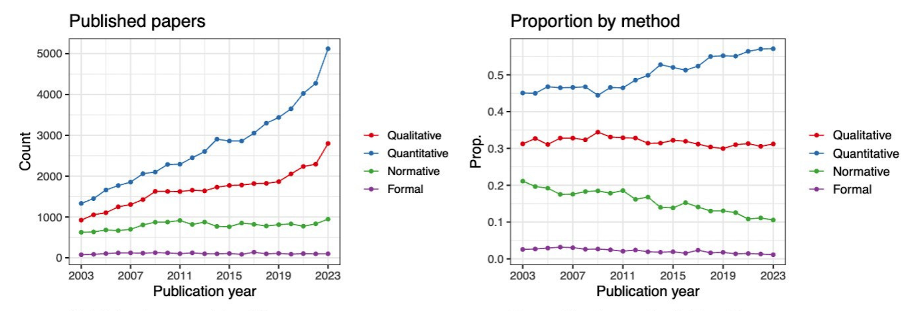{width=100%}
*Source: Carolina Torreblanca*

## Proportion of Political Science papers by method

- Political science is **methodologically pluralistic**
- You don’t have to *use* quantitative methods to benefit from them
- Statistics helps you **interpret evidence** and **engage with the broader literature**

<!-- - **Does not mean** quantitative methods are better -->
<!-- - **Does not mean** you have to use quantitative methods -->
<!-- - But learning **some statistics** is helpful to engage with the discipline -->


## "According to data..."
### Do data speak?

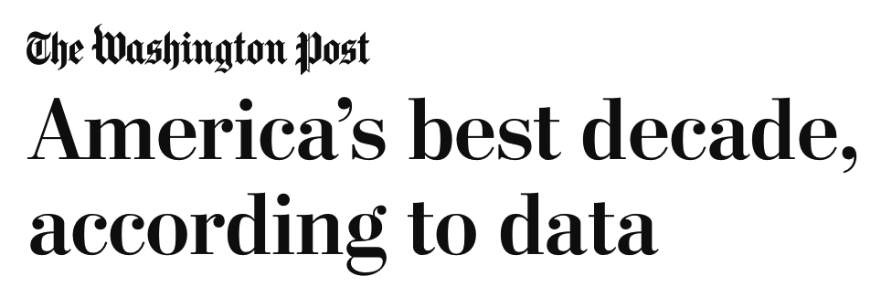{width=50%}
{width=50%}


## "According to data..."
### Do data speak?

- Implied: data reveals objective truth
- Reality: data **requires interpretation**


## What data look like?
### Variables

Characteristics that vary  
<!-- 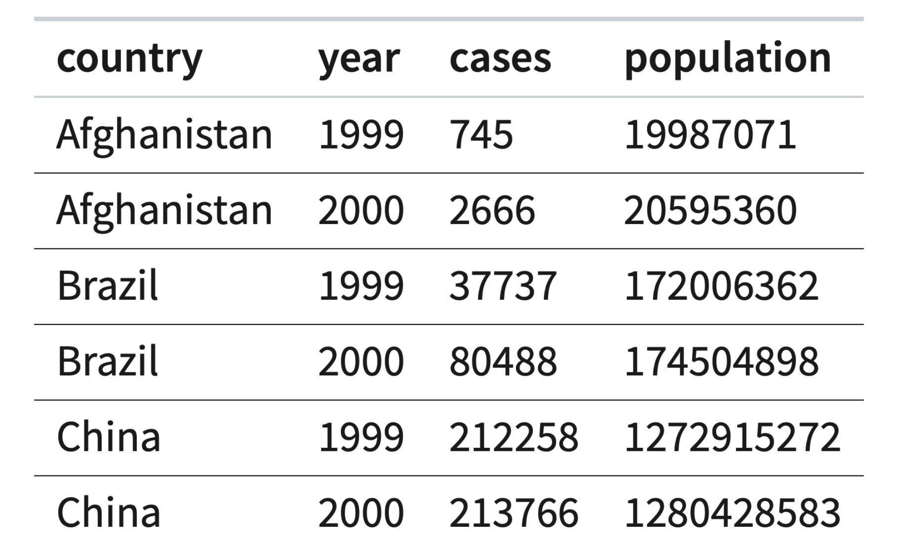{width=70%} -->

```{r}

library(qatarcars)
library(dplyr)
library(tidyr)
library(knitr)
library(kableExtra)
library(gapminder)  # Example international dataset

#| echo: false


# Load data and select a few columns
ip_data <- gapminder %>%
  filter(year >= 2007) %>%
  select(country, continent, year, lifeExp, gdpPercap)

# Take first 6 rows
ip_head <- head(ip_data)

# Display table with kableExtra styling
ip_head %>%
  kable(
    caption = "",
    col.names = c("Country", "Continent", "Year", "Life Expectancy", "GDP per Capita"),
    booktabs = TRUE,
    align = c("l","l","r","r","r"),
    digits = 1
  ) %>%
  kable_styling(full_width = FALSE, position = "center", font_size = 30)

```

*Source: Gapminder Foundation*

## Types of Variables

- Nominal/categorical: **Cannot be ordered** 
  - Region, conflict types
- Ordinal: **Ordered**
  -  Liberal < Moderate < Conservative 
- Numerical: Ordered + **equidistant**
  - Age, GDP, number of casualties


## Political Regimes
### Interactive Map

<iframe 
    src="https://ourworldindata.org/grapher/political-regime?tab=map" 
    loading="lazy" 
    style="width:100%; height:600px; border:0;" 
    allow="web-share; clipboard-write">
</iframe>

## Practice
### Varieties of Democracy’s regime type measure:

- 0: Closed autocracy – No multiparty elections
- 1: Electoral autocracy – De-jure elections but not free and fair
- 2: Electoral democracy – Free and fair elections with some flaws
- 3: Liberal democracy – Free and fair elections guaranteed


## Descriptive Statistics
### Summarizing Patterns: Categorical data


- Counts / frequencies: How many observations fall in each category.
- Percentages / proportions: Useful to compare groups.
- Mode: The most common category.


## Descriptive Statistics: Categorical variables

```{r}

library(qatarcars)
library(dplyr)
library(tidyr)
library(knitr)
library(kableExtra)

#| echo: false
cat_vars <- c("type","origin","make")  # replace with your categorical columns

cat_summary <- qatarcars %>%
  select(all_of(cat_vars)) %>%
  pivot_longer(everything(), names_to = "Variable", values_to = "Value") %>%
  group_by(Variable, Value) %>%
  summarise(Count = n(), .groups = "drop") %>%
  group_by(Variable) %>%
  mutate(Percent = 100 * Count / sum(Count)) %>%
  arrange(Variable, desc(Count)) %>%
  group_by(Variable) %>%
  slice_max(order_by = Count, n = 4) %>%  # show top 4 per variable
  ungroup()

# Make table show variable once per group
cat_summary %>%
  kable(
    caption = "Top Categories for Qatar Cars Variables",
    col.names = c("Variable", "Category", "Count", "Percent"),
    booktabs = TRUE,
    align = c("l","l","r","r"),
    digits = 1
  ) %>%
  kable_styling(full_width = FALSE, position = "center", font_size = 18) %>%
  collapse_rows(columns = 1, valign = "top")  
```

*Data source: https://github.com/profmusgrave/qatarcars*


## Descriptive Statistics
### Summarizing Patterns: Numerical data


- Measures of central tendency:
  - Mean (average): Add values, divide by count
  - Median: Middle value when ordered
  - Mode: Most common value
- Measures of spread / variability:
  - Range: Difference between max and min
  - Standard deviation 


## Descriptive Statistics: Numerical variables

```{r}
#| echo: false


# Compute descriptive stats for numeric variables
summary_tbl <- qatarcars %>%
  summarise(across(where(is.numeric), list(
    mean = ~mean(.x, na.rm = TRUE),
    sd   = ~sd(.x, na.rm = TRUE),
    min  = ~min(.x, na.rm = TRUE),
    max  = ~max(.x, na.rm = TRUE)
  ))) %>%
  pivot_longer(everything(), names_to = c("Variable", "Stat"), names_sep = "_") %>%
  pivot_wider(names_from = Stat, values_from = value) %>%
  # Format all numeric columns to 2 decimal places
  mutate(across(where(is.numeric), ~sprintf("%.2f", .x)))

# Print table nicely
summary_tbl %>%
  kable(
    caption = "Descriptive Statistics for Qatar Cars Variables",
    booktabs = TRUE
  ) %>%
  kable_styling(full_width = FALSE, position = "center", font_size = 20)
```

*Data source: https://github.com/profmusgrave/qatarcars*


## Predictive Analysis
### Can we forecast/predict outcomes?


- Use patterns to **predict an outcome**.
- Example: **Next election**, would we expect a high or low turnout at a **university town?**


## Toy example
### New university in town
- Suppose turnout differs by age based on past data:
  - Young voters (18–25): <b>40%</b> turnout

- Everyone else: <b>65%</b> turnout
- We can roughly predict the turnout based on share of young voters in town
<div style="width:100%; font-size:70%;">

  <!-- <p> -->
  <!--   Suppose turnout differs by age: -->
  <!--   <br> -->
  <!--   • Young voters (18–25): <b>40%</b> turnout   -->
  <!--   <br> -->
  <!--   • Everyone else: <b>65%</b> turnout -->
  <!-- </p> -->

  <label for="youngShare">
    Share of young voters in town:
    <b><span id="youngLabel">20</span>%</b>
  </label>

  <input type="range" id="youngShare" min="0" max="60" value="20" step="5"
         style="width:100%;">

  <p id="prediction" style="margin-top:8px;"></p>

  <p style="color:gray; font-size:85%;">
    <!-- This is a prediction based on composition — not a causal effect. -->
  </p>
</div>

<script>
  const slider = document.getElementById("youngShare");
  const label = document.getElementById("youngLabel");
  const output = document.getElementById("prediction");

  function update() {
    const young = slider.value / 100;
    const turnout = young * 40 + (1 - young) * 65;

    label.innerText = slider.value;
    output.innerText =
      "Predicted turnout = " +
      slider.value + "% × 40% + " +
      (100 - slider.value) + "% × 65% = " +
      turnout.toFixed(1) + "%";
  }

  slider.addEventListener("input", update);
  update();
</script>


## Predictive Analysis
### 
- Widely used in **private sector:** credit scoring, fraud detection, demand forecasting
- Also common in **public policy:** forecasting crime, turnout, ER visits
- Uses many variables with machine learning models
- What if we ask a <span style="color:#8B0000;">**causal question?**</span> 

## Causal Inference
### Going beyond associations


::: columns

::: {.column width="60%"}


- The ultimate question: 
  - **does changing X change Y?**
- X: Independent variable
- Y: Dependent variable
<!-- - Causal claims are everywhere -->


  
:::

::: {.column width="40%"}

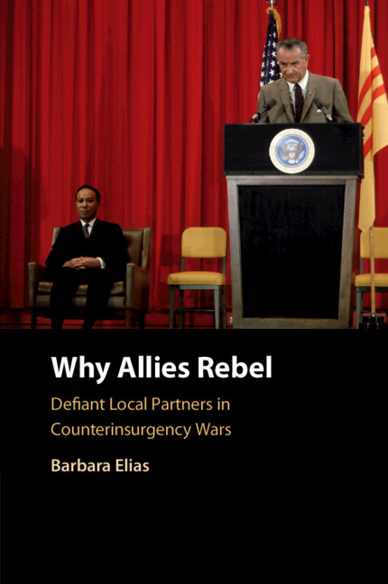{width=80%}

:::

:::


## A Toy Example
### Foreign Aid and Political Stability

- **Question:**  
  - Does foreign aid reduce political unrest?

- Outcome: **number of anti-government protests**

---

## A Naive Comparison
### Treated vs. Untreated Countries

<div style="width:auto; min-width:600px;">
  <button id="slide1_reveal" style="font-size:0%; margin-bottom:5px;">🔁 Reveal counterfactuals</button>

  <table border="1" cellpadding="2" cellspacing="0" style="font-size:55%; border-collapse: collapse; table-layout: fixed; width:100%;">
    <thead>
      <tr>
        <th style="padding:2px; width:60px;">Country</th>
        <th style="padding:2px; width:80px;">Aid status</th>
        <th style="padding:2px; width:80px;">Observed protests</th>
        <th id="slide1_cf_aid_header" style="color:#5b7c99; padding:2px; width:90px; visibility:hidden;">Protests if received aid</th>
        <th id="slide1_cf_noaid_header" style="color:darkred; padding:2px; width:90px; visibility:hidden;">Protests if no aid</th>
        <th id="slide1_eff_header" style="color:darkgreen; padding:2px; width:90px; visibility:hidden;">Actual effect of aid</th>
      </tr>
    </thead>
    <tbody>
      <tr><td>A</td><td id="slide1_A_status"></td><td id="slide1_A_obs"></td><td id="slide1_A_withAid" style="visibility:hidden"></td><td id="slide1_A_noAid" style="visibility:hidden"></td><td id="slide1_A_eff" style="visibility:hidden"></td></tr>
      <tr><td>B</td><td id="slide1_B_status"></td><td id="slide1_B_obs"></td><td id="slide1_B_withAid" style="visibility:hidden"></td><td id="slide1_B_noAid" style="visibility:hidden"></td><td id="slide1_B_eff" style="visibility:hidden"></td></tr>
      <tr><td>C</td><td id="slide1_C_status"></td><td id="slide1_C_obs"></td><td id="slide1_C_withAid" style="visibility:hidden"></td><td id="slide1_C_noAid" style="visibility:hidden"></td><td id="slide1_C_eff" style="visibility:hidden"></td></tr>
      <tr><td>D</td><td id="slide1_D_status"></td><td id="slide1_D_obs"></td><td id="slide1_D_withAid" style="visibility:hidden"></td><td id="slide1_D_noAid" style="visibility:hidden"></td><td id="slide1_D_eff" style="visibility:hidden"></td></tr>
      <tr><td>E</td><td id="slide1_E_status"></td><td id="slide1_E_obs"></td><td id="slide1_E_withAid" style="visibility:hidden"></td><td id="slide1_E_noAid" style="visibility:hidden"></td><td id="slide1_E_eff" style="visibility:hidden"></td></tr>
      <tr><td>F</td><td id="slide1_F_status"></td><td id="slide1_F_obs"></td><td id="slide1_F_withAid" style="visibility:hidden"></td><td id="slide1_F_noAid" style="visibility:hidden"></td><td id="slide1_F_eff" style="visibility:hidden"></td></tr>
    </tbody>
  </table>

  <p id="slide1_naive" style="font-size:75%; margin-top:5px;"></p>
  <p id="slide1_true" style="font-size:75%; margin-top:2px;"></p>
</div>

<script>
  const slide1_data = {
    A: {observed: 5, aidStatus: "Received Aid", withAid: 5, noAid: 7},
    B: {observed: 4, aidStatus: "No Aid",       withAid: 3, noAid: 4},
    C: {observed: 3, aidStatus: "No Aid",       withAid: 0, noAid: 3},
    D: {observed: 6, aidStatus: "Received Aid", withAid: 6, noAid: 8},
    E: {observed: 4, aidStatus: "No Aid",       withAid: 1, noAid: 4},
    F: {observed: 7, aidStatus: "Received Aid", withAid: 7, noAid: 8}
  };

  let slide1_revealed = false;

  function slide1_update() {
    let naiveAidSum = 0, naiveAidCount = 0;
    let naiveNoAidSum = 0, naiveNoAidCount = 0;
    let trueSum = 0;
    const countries = ["A","B","C","D","E","F"];

    countries.forEach(c => {
      const row = slide1_data[c];
      const obsEl = document.getElementById("slide1_"+c+"_obs");
      const statusEl = document.getElementById("slide1_"+c+"_status");

      // Aid status color
      statusEl.innerText = row.aidStatus;
      statusEl.style.color = row.aidStatus==="Received Aid" ? "darkgreen" : "darkred";

      // Observed value always matches realized potential outcome
      obsEl.innerText = row.observed;
      obsEl.style.color = "black";

      // For naive diff calculation
      if(row.aidStatus === "Received Aid"){
        naiveAidSum += row.observed; naiveAidCount++;
      } else {
        naiveNoAidSum += row.observed; naiveNoAidCount++;
      }

      if(slide1_revealed){
        ["withAid","noAid","eff"].forEach(id=>{
          document.getElementById("slide1_"+c+"_"+id).style.visibility = "visible";
          document.getElementById("slide1_"+c+"_"+id).style.color = "black";
        });
        ["slide1_cf_aid_header","slide1_cf_noaid_header","slide1_eff_header"].forEach(id=>{
          document.getElementById(id).style.visibility = "visible";
        });

        // Only show potential outcome if different from observed
        document.getElementById("slide1_"+c+"_withAid").innerText = row.withAid !== row.observed ? row.withAid : "";
        document.getElementById("slide1_"+c+"_noAid").innerText = row.noAid !== row.observed ? row.noAid : "";

        document.getElementById("slide1_"+c+"_eff").innerText = row.withAid - row.noAid;

        trueSum += row.withAid - row.noAid;
      } else {
        ["withAid","noAid","eff"].forEach(id=>{
          document.getElementById("slide1_"+c+"_"+id).style.visibility = "hidden";
        });
        ["slide1_cf_aid_header","slide1_cf_noaid_header","slide1_eff_header"].forEach(id=>{
          document.getElementById(id).style.visibility = "hidden";
        });
      }
    });

    const naiveDiff = (naiveAidSum/naiveAidCount - naiveNoAidSum/naiveNoAidCount).toFixed(2);
    document.getElementById("slide1_naive").innerText = "Average protest when received aid - Average protest when no aid) = (5+6+7)/3 - (3+4+4)/3 = " + naiveDiff;
    document.getElementById("slide1_true").innerText = slide1_revealed ? "True average effect of aid = (-2-1-3-2-3-1)/6 = " + (trueSum/6).toFixed(2) : "";
  }

  document.getElementById("slide1_reveal").addEventListener("click", ()=>{
    slide1_revealed = !slide1_revealed;
    document.getElementById("slide1_reveal").innerText = slide1_revealed ? "🔒 Hide counterfactuals" : "🔁 Reveal counterfactuals";
    slide1_update();
  });

  slide1_update();
</script>


## A Naive Comparison
### Treated vs. Untreated Countries

- **Naive conclusion:**  
  - Foreign aid increases protests

- ⚠️ But should we believe this?

---

## What Might Be Going Wrong?
### Aid Is Not Random


::: columns

::: {.column width="60%"}


- Foreign aid might be sent to:
  - Politically unstable countries
  - Which introduces **selection bias**
  
- These countries would likely have **more protests anyway**

- We are comparing **different kinds of countries**.

  
:::

::: {.column width="40%"}

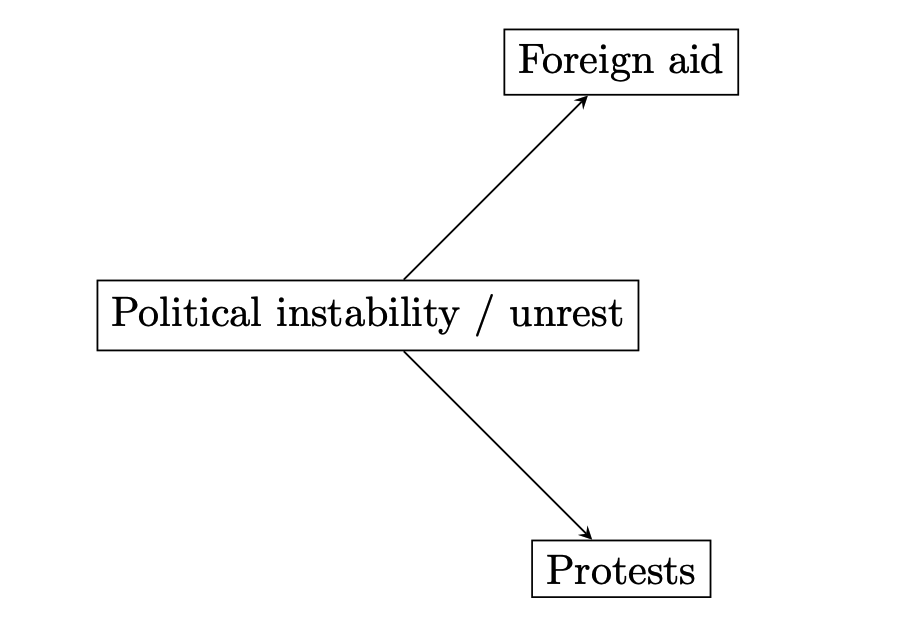{width=100%}

:::

:::


<!-- ## Selection Bias -->
<!-- ### When Comparison Is Misleading -->

<!-- - Countries receiving aid are different *before* aid -->
<!-- - Instability affects: -->
<!--   - Whether aid is given -->
<!--   - How many protests occur -->

<!-- - So the difference we see may **not be caused by aid**. -->


<!-- ## The Core Problem -->
<!-- ### We Don't See Both Worlds -->

<!-- For any single country: -->
<!-- - We see what happens **with aid** -->
<!-- - Or what happens **without aid** -->

<!-- But not both. -->

<!-- One outcome is **missing**. -->

<!-- --- -->

## Counterfactual Thinking
### The Missing Comparison

- The **counterfactual** asks:
  - *What would have happened **if X did not change/did not take place?***
- In this example:
  - A country received aid
  - Counterfactual: ***What if it had not?***

<!-- - Causal inference is about reasoning with these missing outcomes. -->


## Counterfactuals
### Causal claims

- Countries **that receive aid** have more protests.
<!-- - If Trump did not win 2024 elections, would Maduro still be in power?  -->
- Countries **that experience civil wars** have lower economic growth
- People **who receive encouraging mailers** are more likely to vote
<!-- - How EU ascension impacts a country’s trade imbalance -->
- Messi won the World Cup thanks to the **host country.**
<!-- If it wasn’t for Qatar, would **Messi win the World Cup?** -->


---

## Interactive Intuition
### Toggle Between Worlds

- Imagine switching between:
  - A world **with aid**
  - A world **without aid**

- This is the core idea behind causal inference.

## Interactive Intuition
### Toggle Between Worlds

<div style="width:auto; min-width:600px;">
  <button id="slide2_reveal" style="font-size:50%; margin-bottom:5px;">🔁 Reveal counterfactuals</button>

  <table border="1" cellpadding="2" cellspacing="0" style="font-size:55%; border-collapse: collapse; table-layout: fixed; width:100%;">
    <thead>
      <tr>
        <th style="padding:2px; width:60px;">Country</th>
        <th style="padding:2px; width:80px;">Aid status</th>
        <th style="padding:2px; width:80px;">Observed protests</th>
        <th id="slide2_cf_aid_header" style="color:#5b7c99; padding:2px; width:90px; visibility:hidden;">Protests if received aid</th>
        <th id="slide2_cf_noaid_header" style="color:darkred; padding:2px; width:90px; visibility:hidden;">Protests if no aid</th>
        <th id="slide2_eff_header" style="color:darkgreen; padding:2px; width:90px; visibility:hidden;">Actual effect of aid</th>
      </tr>
    </thead>
    <tbody>
      <tr><td>A</td><td id="slide2_A_status"></td><td id="slide2_A_obs"></td><td id="slide2_A_withAid" style="visibility:hidden"></td><td id="slide2_A_noAid" style="visibility:hidden"></td><td id="slide2_A_eff" style="visibility:hidden"></td></tr>
      <tr><td>B</td><td id="slide2_B_status"></td><td id="slide2_B_obs"></td><td id="slide2_B_withAid" style="visibility:hidden"></td><td id="slide2_B_noAid" style="visibility:hidden"></td><td id="slide2_B_eff" style="visibility:hidden"></td></tr>
      <tr><td>C</td><td id="slide2_C_status"></td><td id="slide2_C_obs"></td><td id="slide2_C_withAid" style="visibility:hidden"></td><td id="slide2_C_noAid" style="visibility:hidden"></td><td id="slide2_C_eff" style="visibility:hidden"></td></tr>
      <tr><td>D</td><td id="slide2_D_status"></td><td id="slide2_D_obs"></td><td id="slide2_D_withAid" style="visibility:hidden"></td><td id="slide2_D_noAid" style="visibility:hidden"></td><td id="slide2_D_eff" style="visibility:hidden"></td></tr>
      <tr><td>E</td><td id="slide2_E_status"></td><td id="slide2_E_obs"></td><td id="slide2_E_withAid" style="visibility:hidden"></td><td id="slide2_E_noAid" style="visibility:hidden"></td><td id="slide2_E_eff" style="visibility:hidden"></td></tr>
      <tr><td>F</td><td id="slide2_F_status"></td><td id="slide2_F_obs"></td><td id="slide2_F_withAid" style="visibility:hidden"></td><td id="slide2_F_noAid" style="visibility:hidden"></td><td id="slide2_F_eff" style="visibility:hidden"></td></tr>
    </tbody>
  </table>

  <p id="slide2_naive" style="font-size:75%; margin-top:5px;"></p>
  <p id="slide2_true" style="font-size:75%; margin-top:2px;"></p>
</div>

<script>
  const slide2_data = {
    A: {observed: 5, aidStatus: "Received Aid", withAid: 5, noAid: 7},
    B: {observed: 4, aidStatus: "No Aid",       withAid: 3, noAid: 4},
    C: {observed: 3, aidStatus: "No Aid",       withAid: 0, noAid: 3},
    D: {observed: 6, aidStatus: "Received Aid", withAid: 6, noAid: 8},
    E: {observed: 4, aidStatus: "No Aid",       withAid: 1, noAid: 4},
    F: {observed: 7, aidStatus: "Received Aid", withAid: 7, noAid: 8}
  };

  let slide2_revealed = false;

  function slide2_update() {
    let naiveAidSum = 0, naiveAidCount = 0;
    let naiveNoAidSum = 0, naiveNoAidCount = 0;
    let trueSum = 0;
    const countries = ["A","B","C","D","E","F"];

    countries.forEach(c => {
      const row = slide2_data[c];
      const obsEl = document.getElementById("slide2_"+c+"_obs");
      const statusEl = document.getElementById("slide2_"+c+"_status");

      // Aid status color
      statusEl.innerText = row.aidStatus;
      statusEl.style.color = row.aidStatus==="Received Aid" ? "darkgreen" : "darkred";

      // Observed value always matches realized potential outcome
      obsEl.innerText = row.observed;
      obsEl.style.color = "black";

      // For naive diff calculation
      if(row.aidStatus === "Received Aid"){
        naiveAidSum += row.observed; naiveAidCount++;
      } else {
        naiveNoAidSum += row.observed; naiveNoAidCount++;
      }

      if(slide2_revealed){
        ["withAid","noAid","eff"].forEach(id=>{
          document.getElementById("slide2_"+c+"_"+id).style.visibility = "visible";
          document.getElementById("slide2_"+c+"_"+id).style.color = "black";
        });
        ["slide2_cf_aid_header","slide2_cf_noaid_header","slide2_eff_header"].forEach(id=>{
          document.getElementById(id).style.visibility = "visible";
        });

        // Only show potential outcome if different from observed
        document.getElementById("slide2_"+c+"_withAid").innerText = row.withAid !== row.observed ? row.withAid : "";
        document.getElementById("slide2_"+c+"_noAid").innerText = row.noAid !== row.observed ? row.noAid : "";

        document.getElementById("slide2_"+c+"_eff").innerText = row.withAid - row.noAid;

        trueSum += row.withAid - row.noAid;
      } else {
        ["withAid","noAid","eff"].forEach(id=>{
          document.getElementById("slide2_"+c+"_"+id).style.visibility = "hidden";
        });
        ["slide2_cf_aid_header","slide2_cf_noaid_header","slide2_eff_header"].forEach(id=>{
          document.getElementById(id).style.visibility = "hidden";
        });
      }
    });

    const naiveDiff = (naiveAidSum/naiveAidCount - naiveNoAidSum/naiveNoAidCount).toFixed(2);
    document.getElementById("slide2_naive").innerText = "Naive difference (avg aid - avg no aid) = (5+6+7)/3 - (3+4+4)/3 = " + naiveDiff;
    document.getElementById("slide2_true").innerText = slide2_revealed ? "True average effect of aid = (-2-1-3-2-3-1)/6 = " + (trueSum/6).toFixed(2) : "";
  }

  document.getElementById("slide2_reveal").addEventListener("click", ()=>{
    slide2_revealed = !slide2_revealed;
    document.getElementById("slide2_reveal").innerText = slide2_revealed ? "🔒 Hide counterfactuals" : "🔁 Reveal counterfactuals";
    slide2_update();
  });

  slide2_update();
</script>

<!-- ## Causal Inference -->
<!-- ### Does a change in X cause a change in Y? -->

<!-- - Patterns alone are not enough -->
<!--   - Observations that are treated and not treated tend to be **systematically different:** <span style="color:#8B0000;">**Selection bias**</span>  -->
<!-- - Without counterfactuals, it is difficult to make causal claims -->

## 

<div style="display:flex; justify-content:center; align-items:center; height:100%;">
  <h1 style="font-size:3em; text-align:center;">
    <span style="color:#000080;">**How do we detect counterfactuals?**</span>
  </h1>
</div>


##

<div style="display:flex; justify-content:center; align-items:center; height:100%;">
  <h1 style="font-size:3em; text-align:center;">
    <span style="color:#000080;">**Bad news:**</span> <span style="color:#8B0000;">**we can't**</span> 
  </h1>
</div>

##

<div style="display:flex; justify-content:center; align-items:center; height:100%;">
  <h1 style="font-size:3em; text-align:center;">
    <span style="color:#000080;">**Bad news:**</span> <span style="color:#8B0000;">**we can't**</span> 
  </h1>
</div>

**Fundamental Problem of Causal Inference: We never observe the counterfactual**

## 

<div style="display:flex; justify-content:center; align-items:center; height:100%;">
  <h1 style="font-size:3em; text-align:center;">
    <span style="color:#000080;">**Good news:**</span> <span style="color:#8B0000;">**we can impute them**</span> 
  </h1>
</div>

## 

<div style="display:flex; justify-content:center; align-items:center; height:100%;">
  <h1 style="font-size:3em; text-align:center;">
    <span style="color:#000080;">**Good news:**</span> <span style="color:#8B0000;">**we can impute them**</span> 
  </h1>
</div>
**Causal inference = imputing the counterfactual and estimating the effect**

## Imputing the counterfactual

- Qualitatively
  - Case studies and process tracing

- Quantitatively
  - Experiments
  - Observational studies
  
  

## Experiments
### Gold standard?

- **Random assignment** ensures no selection bias
- Some consider experiments gold standard - we will come back to it in a minute

## Let's think about this intuitively
### An example from a field experiment in Pakistan (Cheema et al. 2022, APSR)


- How can we close persistent gender gaps in political participation?
   - Male household members as **“gatekeepers” of women’s participation**
- Canvassing women -> no effect
- **Canvassing male household members** -> increase in women’s turnout 


## Example

::: {.columns}

::: {.column width="45%"}
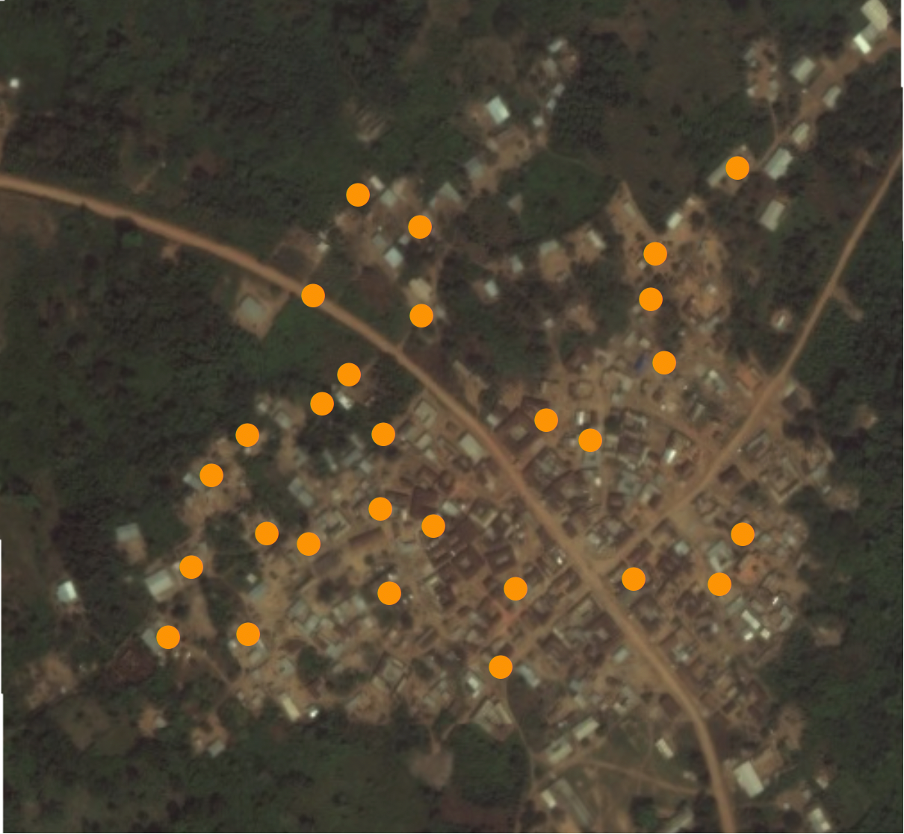{style="width:100%; max-height:300px; display:block; margin:auto;"}
:::

::: {.column width="10%"}
<div class="fragment" style="text-align:center; font-size:2em; margin-top:120px;">
→
</div>
:::

::: {.column width="45%"}
<div class="fragment">
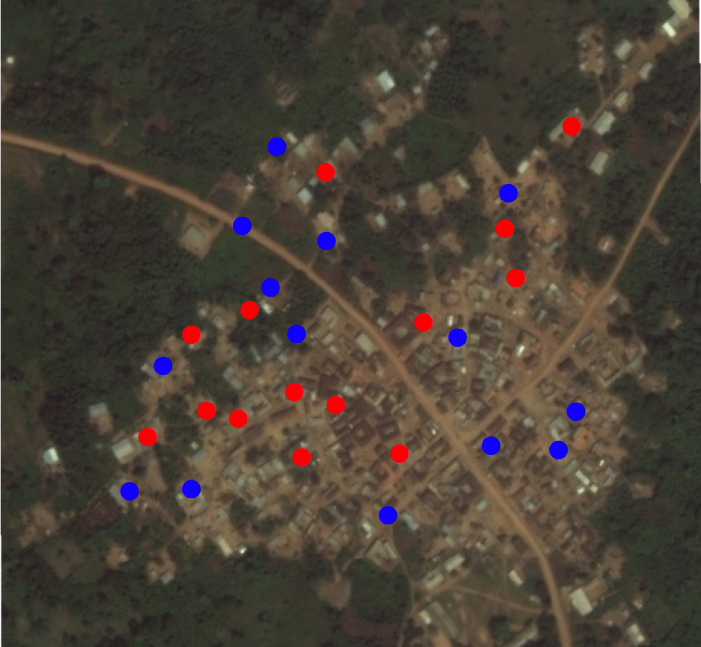{style="width:100%; max-height:300px; display:block; margin:auto;"}
</div>
:::

:::

*Figure: A random sample of households in Pakistan*


<!-- ## Let's think about this intuitively -->
<!-- ### An example from a field experiment in Pakistan (Cheema et al. 2022) -->


<!-- 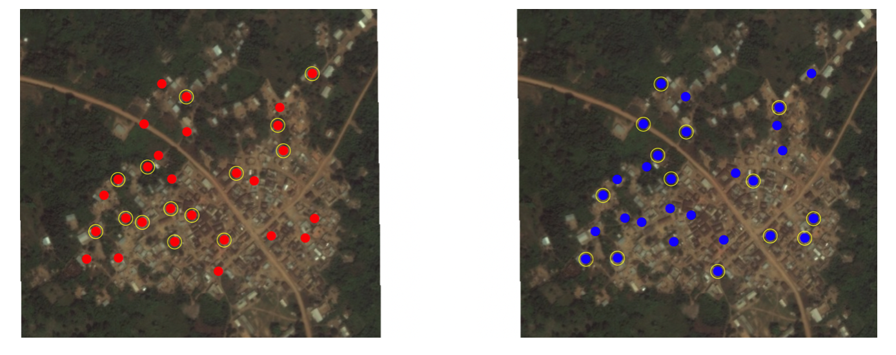{width=40%} -->


<!-- *Random assignment to treated or control means **we’re drawing a random sample of these potential outcomes*** -->

<!-- xxxxxxxxxxxx-->


<!-- ## Exercise -->

<!-- - Asking male households how much they support women's political participation -->
<!-- - 1: Not support at all -->
<!-- - 5: Strongly support -->

<!-- ## Exercise -->

<!-- - Let's assume these are the potential outcomes: -->
<!-- 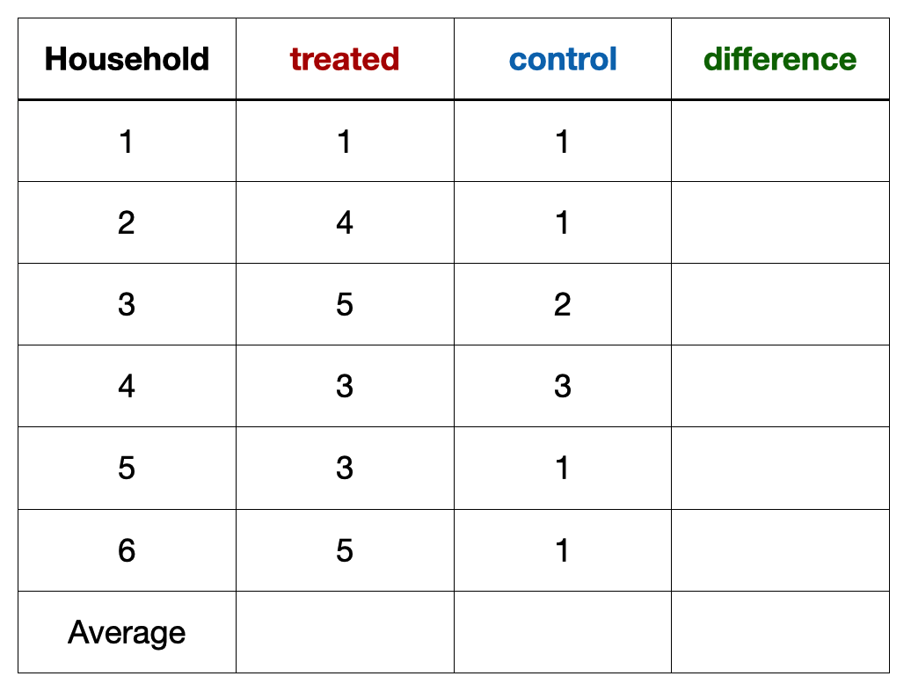{width=40%} -->


<!-- ## Exercise -->

<!-- - Let's assume these are the potential outcomes: -->
<!-- 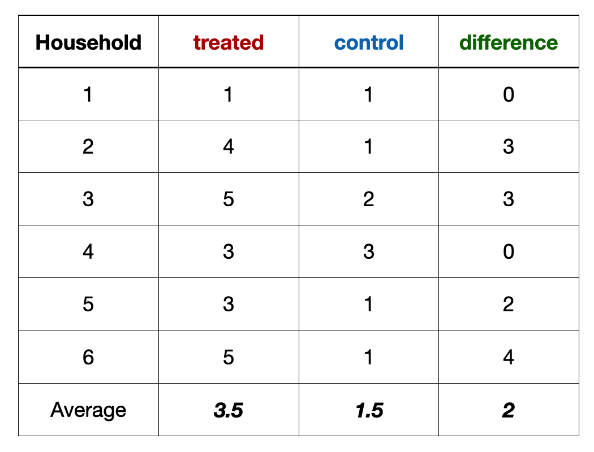{width=40%} -->


<!-- ## Exercise -->

<!-- - With random assignment, we realize the potential outcomes: -->
<!--   - Some households are realized as **treated** -->
<!--   - Some households are realized as **control** -->
<!-- 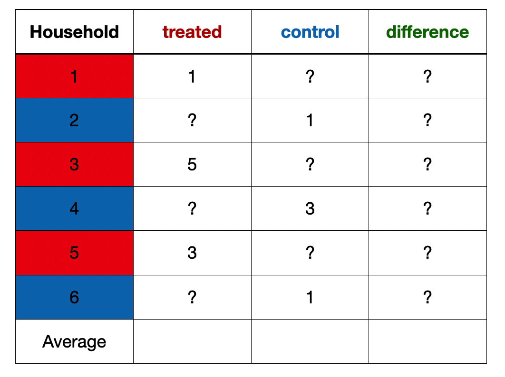{width=40%} -->


<!-- ## Exercise -->

<!-- - Since we can only realize one outcome, we do not know individual causal effect -->
<!-- - But we can **estimate the average treatment effect** -->
<!-- 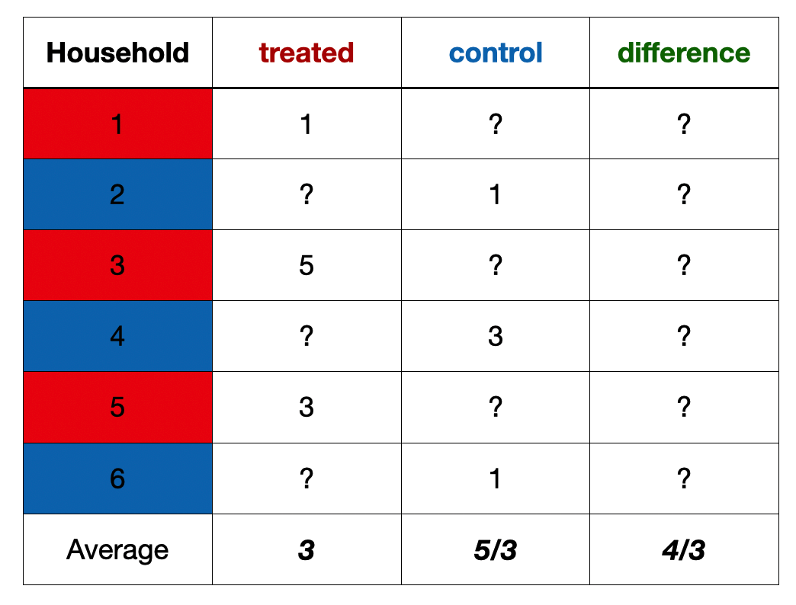{width=40%} -->


<!-- ## Experiments -->
<!-- ### Limitations -->

<!-- - Why not run experiments for everything? -->
<!--   - Practicality  -->
<!--   - Feasibility -->
<!--   - Ethical considerations  -->

## Experiments
### Limitations

- Why not run experiments for everything?
  - **Feasibility:** cannot randomly assign many social conditions
  - **Ethical considerations**: Harm, consent, fairness
- Good policies tend to be **targeted, not random**
  - This creates **selection bias**

## Revisiting our research questions
### Can we use experiments?

<!-- - If Trump did not win 2024 elections, would Maduro still be in power?  -->
- Effect of civil war on a country’s economic growth 
- Whether mailers affect voting turnout or not
<!-- - How EU ascension impacts a country’s trade imbalance -->
- If it wasn’t for Qatar, would **Messi win the World Cup?**


- Of the hypothetical research questions above (civil war, mailers, and World Cup), **only one (mailer) is amenable to randomization.**


<!-- ## Observational Designs -->
<!-- ### When we cannot run experiments -->

<!-- - Many social questions **cannot be randomized** -->
<!--   - Democracy, migration, political violence -->


<!-- ## Observational designs -->
<!-- ### When we can not run experiments -->

<!-- - Many social questions can not be randomized -->
<!--   - Examples? -->
<!-- - Most interesting questions/policies tend to favor selection -->
<!--   - Why give welfare to rich? -->
<!-- - Luckily, there are design-based approaches -->

<!-- ## Matching -->
<!-- ### Comparing similar units -->

<!-- - Do UN peacekeeping missions reduce civilian deaths? -->
<!-- - Naive comparison can mislead: Peacekeepers might more likely to be sent to more severe conflicts. -->
<!-- - Compare only those with similar conflict intensity. -->

<!-- ## Discontinuity designs -->
<!-- ### Compare units around a threshold -->

<!-- - Thresholds allow for natural divergence:  -->
<!--   - Elections -->
<!--   - Welfare programs -->

<!-- - Example: How does tutoring affect student performance? -->

<!--   - Selection bias: Students who do and do not receive tutoring might be systematically different -->

<!-- - Discontinuity: Students who score 70 or below are automatically enrolled in a free tutoring program and receive assistance throughout the year. -->

## Matching
### Comparing similar units

- **Idea:** Compare units that are **similar in important ways**, except for whether they received the treatment
  <!-- - This helps reduce unfair comparisons -->

- **Example:** Do UN PK missions reduce civilian deaths?
  - Selection Bias: PKs might be sent to **more violent conflicts**
  - Solution: Compare **similarly violent conflicts**
    - Some with peacekeepers | some without
    
    
## Discontinuity Designs
### Comparing units near a cutoff

- Some policies use **clear rules or thresholds**
  - Welfare programs, exams

- Example: **Does tutoring improve student performance?**
    - Selection bias: Wealth, family, neighborhood

<!-- - Problem: Students who do and do not get tutoring may already be different -->
  
- Policy: Students scoring **70 or below** get tutoring
  - Compare students **just below and just above 70**


## Discontinuity designs
### Compare units around a threshold

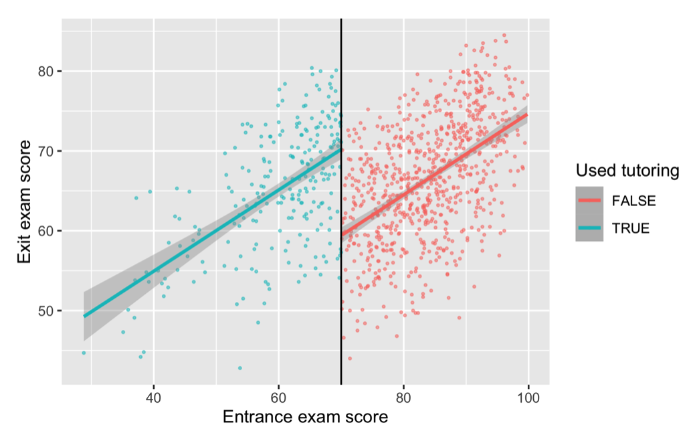{width=40%}

*Source: Andrew Heiss*

<!-- ## Difference in Differences -->
<!-- ### Compare units that follow similar trends the treatment -->

<!-- - How do sanctions affect human rights violations? -->
<!-- - Two countries:  -->
<!--   - One sanctioned (treated) -->
<!--   - One not sanctioned (control) -->
<!-- - The dif-in-dif can be attributed to intervention if -->
<!--   - They follow parallel trends before the intervention -->

## Difference in Differences
### Comparing changes over time

- **Idea:**
  <!-- - Compare how outcomes **change over time** between a treated group and a similar control group -->
  - Focus on differences in **trends**, not levels
- **Example:** How do sanctions affect human rights violations?
  - Two countries: One sanctioned (treated), one not sanctioned (control)
  - Key assumption: Both countries followed **similar trends before** sanctions
    
<!-- ## Difference in Differences -->
<!-- ### Comparing changes over time -->

<!-- - **Example:** How do sanctions affect human rights violations? -->
<!--   - Two countries: -->
<!--     - One sanctioned (treated) -->
<!--     - One not sanctioned (control) -->
<!--   - Key assumption: -->
<!--     - Both countries followed **similar trends before** sanctions -->

    
## Difference in Differences
### Compare units that follow similar trends the treatment

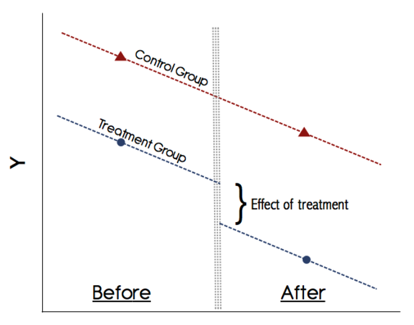{width=30%}

*Source: Kevin Goulding*

## Other designs for observational data

- Instrumental variable, synthetic control
- Shared goal: **imputing the counterfactual using the appropriate design**

## Proportion of Quantitative Political Science papers by research design

<div style="width:100%; text-align:center;">
  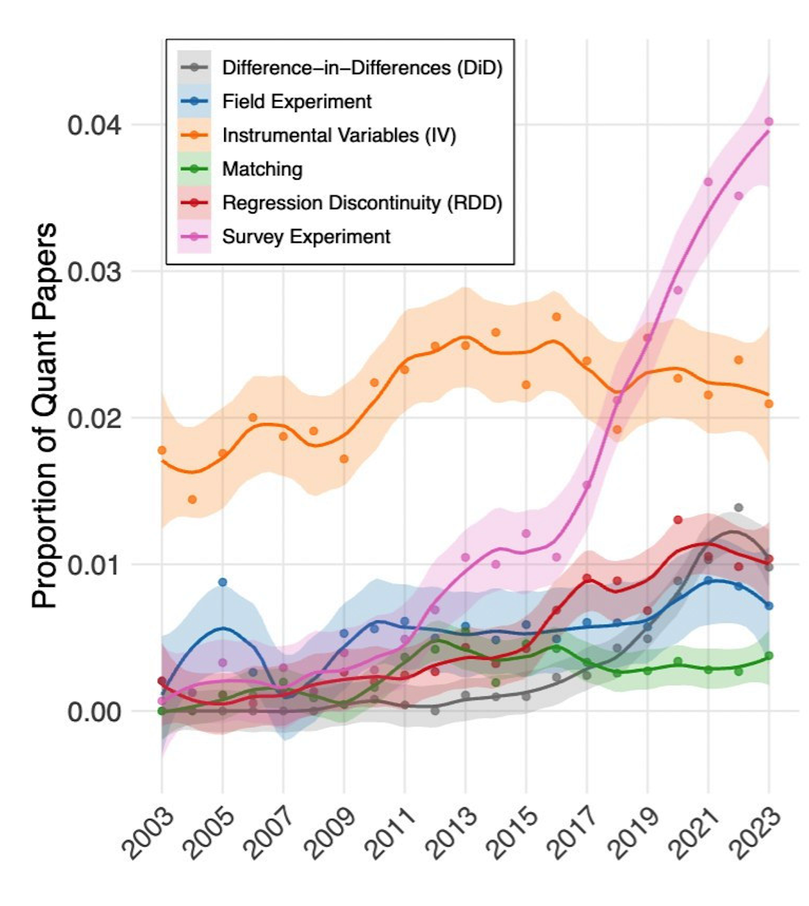
</div>


*Source: Carolina Torreblanca*

## Second-last but not least
### Sample effect $\neq$ Population effect

- We almost always study a sample, **not the whole population**
- A sample might look different from the population
- Statistics gives us tools to estimate population patterns and **measure uncertainty**

## Last but not least
### Data work requires computation

- Computers do the work for us
- Learning some **programming** is unavoidable (R, Python, Stata)
- Luckily, LLMs (ChatGPT, Claude) **lower the learning curve**
- Use with care: **they can be confidently wrong**


## Takeaways
<!-- ### Why statistics matters? -->

- Data don’t speak for themselves: they are produced, measured, and **interpreted by humans.**
- Statistical reasoning is **powerful:**  naive interpretation can **mislead.**
- **Analytical caution is a marketable skill anywhere data are used:** policy, social science literacy, private sector, real-world decision-making. 
<!-- bad data, poor comparisons, or -->

<!-- ## Takeaways -->
<!-- ### Why learn? -->

<!-- - **Policy relevance:** make sense of interventions and their consequences. -->
<!-- - **Social science literacy:** read and critique academic research confidently. -->
<!-- - **Real-world decision-making:** analytical caution is a marketable skill anywhere data are used. -->

## Thank You
### Questions & Discussion

- Thank you for your attention!

- **olgahan@brown.edu**